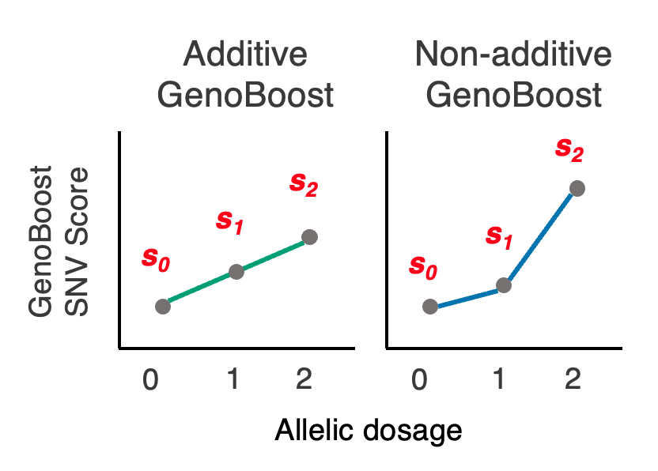
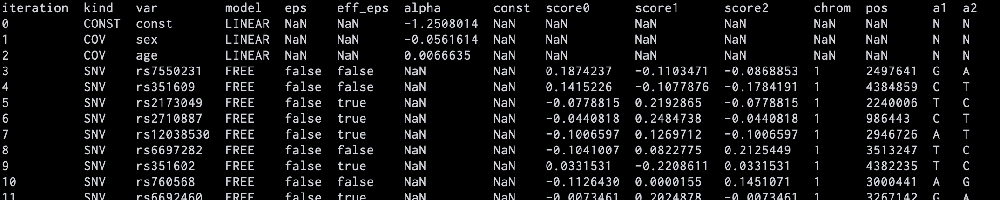
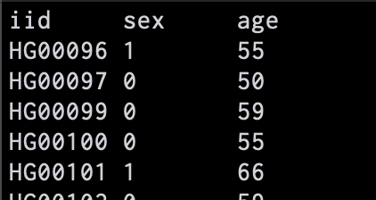
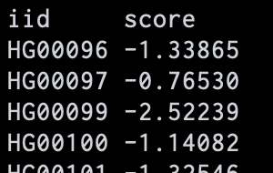

# GenoBoost v0.4.0

[](https://github.com/rickyota/genoboost/actions/workflows/genoboost.yml)
[](https://github.com/rickyota/genoboost/actions/workflows/publish.yml)
[](https://github.com/rickyota/genoboost/actions/workflows/build.yml)

## <a name="started"></a>Getting Started

Download a program for your computer from [here](https://github.com/rickyota/genoboost/releases), and run

```bash
$ genoboost train \
    --dir ./result \
    --file-genot ./example/genot \
    --file-phe ./example/genot.cov \
    --cov age,sex

```

## Table of Contents

- [Getting Started](#started)
- [Introduction](#introduction)
- [Users' Guide](#user-guide)
    - [Installation](#install)
        - [Plink1 Input](#install-plink1)
        - [Plink2 Input](#install-plink2)
    - [Train GenoBoost Model](#train)
        - [Simplest Usage](#train-simple)
        - [Without Validation](#train-train-only)
        - [Input Plink2](#train-plink2)
        - [Cross-validation](#train-cv)
        - [Options for Training](#train-option)
    - [Calculate Sample Scores](#score)
        - [Simplest Usage](#score-simple)
        - [Without Validation](#score-train-only)
        - [Input Plink2](#score-plink2)
        - [Cross-validation](#score-cv)
        - [Options for Score](#score-option)
- [Advanced Guide](#advanced-guide)
    - [Docker](#docker)
    - [Singularity](#singularity)

## <a name="introduction"></a>Introduction

GenoBoost is a polygenic score method to capture additive and non-additive genetic inheritance effects.
So far, most polygenic score methods use the additive model, which exploits an effect size ($\alpha$) and a constant value for each SNV.
GenoBoost exploits three SNV scores ($s_0, s_1, s_2$) for each SNV, corresponding to SNV score for major homozygotes, heterozygotes, and homozygotes. Additive GenoBoost uses linear scores for the SNV scores ($s_2-s_1=s_1-s_0$), and non-additive GenoBoost uses three independent scores to model general non-additive effects.



To fit the model, boosting method is used. GenoBoost iteratively selects the most associated SNV with the phenotype and adding the variant to the polygenic score function. When aalculating the association, the effects already in polygenic score function is excluded to avoid selecting SNVs with duplicated effects.
After the fitting, the SNV scores for selected SNVs are written in the output folder.

There are two parameters: iteration numbers and learning rates. The default values for learning rates are (0.05, 0.1, 0.2, 0.5).

Covariate effects are fitted only once before starting fitting SNVs using multi-variable logistic regression.

## <a name="user-guide"></a>Users' Guide

For now, input genotype format is allowed for plink1 or plink2 only.

### <a name="install"></a>Installation

#### <a name="install-plink1"></a>Plink1 Input

If you want to input plink1, download a program for your computer from [here][release].

#### <a name="install-plink2"></a>Plink2 Input

If you want to input plink2 genotype file, you have to compile by yourself as below. You can use plink1 format as well.

First, install `rust` as instructed [here][rust-install] if not installed. Then,

```bash
git clone https://github.com/rickyota/genoboost.git
cd genoboost
cargo build --manifest-path ./projects_rust/Cargo.toml --release --bin genoboost
cp ./projects_rust/target/release/genoboost ./genoboost
```

and you can use `genoboost` program.

### <a name="train"></a>Train GenoBoost Model

GenoBoost returns SNV weights file with $s_0, s_1, s_2$ for each SNV in one line.




#### <a name="train-simple"></a>Simplest Usage

You can run GenoBoost at least with plink1 genotype files and, in most cases, covariates file.

See `./example/` for reference of file format. For example, covariates file should be tab-deliminated containing `iid` header corresponding to sample id in plink1 fam file.



With the minimum options, GenoBoost produces SNV weights list with the best parameter.
SNV weights list is computed from randomly extracted training samples, and the best parameter is determined in the remaining validation samples.
Write column name to be used in covariates file after `--cov`.

```bash
$ genoboost train \
    --dir ./result \
    --file-genot ./example/genot \
    --file-phe ./example/genot.cov \
    --cov age,sex
```

#### <a name="train-train-only"></a>Without Validation

If you want to treat all samples as training dataset, use `--train-only` option. GenoBoost produces SNV weights each for learning rate. Use `--iter-snv` or `--iter` to control the maximum number of SNVs or iterations for training.

```bash
$ genoboost train \
    --dir ./result \
    --file-genot ./example/genot \
    --file-phe ./example/genot.cov \
    --cov age,sex \
    --train-only \
    --iter-snv 10000
```

#### <a name="train-plink2"></a>Input Plink2

If you use plink2 genotype file (`.pgen`, `.psam` and `.pvar` or `.pvar.zst`), use `--genot-format plink2` or `--genot-format plink2-vzs`.

If phenotype is accompanied with covariates in phenotype file, use `--phe-name` for the phenotype name. If phenotypes and covariates are in plink2 psam file, do not use `--file-phe`.

Control/case format should be `0/1` or `1/2`.

```bash
$ genoboost train \
    --dir ./result \
    --file-genot ./example/genot2 \
    --genot-format plink2-vzs \
    --file-phe ./example/genot2.phe \
    --phe-name PHENO1 \
    --cov age,sex
```

#### <a name="train-cv"></a>Cross-validation

If you want to run k-fold cross-validation, use `--cross-validation (k)`. GenoBoost will split the samples into k chunks and run k times training with one of chunks be the validation samples. You can control how to split the samples with random seed.

```bash
$ genoboost train \
    --dir ./result \
    --file-genot ./example/genot \
    --file-phe ./example/genot.cov \
    --cov age,sex \
    --cross-validation 5 \
    --seed 51
```

#### <a name="train-option"></a> Options for Training

`--dir <DIR>` : Directory to output.

`--file-genot <FILE>`: Prefix of a plink1 or plink2 file (.bed, .fam, .bim or .pgen, .psam, .pvar/.pvar.zst should exist).

`--genot-format [FORMAT]`: {`plink`, `plink2`, `plink2-vzs`}. Genotype format. Default is `plink`.

`--file-phe [FILE]`: Phenotype or covariates file.

`--phe [NAME]`: Phenotype name specified in --file-phe or psam file.

`--cov [NAMES]`: Covariates names in comma-delimited format. ex. `age,sex,PC1-PC10`.

`--file-sample [FILE]`: Sample file for training. One line for one sample id.

`--file-sample-val [FILE]`: Sample file for validation.

`--file-snv [FILE]`: Snv file for training. One line for one SNV id.

`--iter-snv [NUMBER]`, `--iter [NUMBER]` : Maximum number of SNVs or iterations for training.

`--learning-rates [NUMBERS]`: Learning rates in space-delimited format. Default value is `"0.5 0.2 0.1 0.05"`.

`--cross-validation [NUMBER]`: Number of cross-validations.

`--seed [NUMBER]`: Random seed to control sample split.

`--train-only`: Run without validation.

`--verbose`: Let GenoBoost speak more!

### <a name="score"></a> Calculate Sample Scores

GenoBoost returns polygenic score for each sample. GenoBoost outputs scores without covariates (`score.tsv`) and with covariates (`score.withcov.tsv`).



#### <a name="score-simple"></a>Simplest Usage

With the minimum options, GenoBoost will calculate sample scores from SNV weights with the best parameters determined in the validation dataset.

```bash
$ genoboost score \
    --dir-score ./result_score \
    --dir-wgt ./result \
    --file-genot ./example/genot \
    --file-phe ./example/genot.cov \
    --cov age,sex
```

#### <a name="score-train-only"></a>Without Validation

If you did not use validation dataset in training phase, GenoBoost will output sample scores for all parameters. You have to specify the number of SNVs in `--iters`.

```bash
$ genoboost score \
    --dir-score ./result_score \
    --dir-wgt ./result \
    --file-genot ./example/genot \
    --file-phe ./example/genot.cov \
    --cov age,sex \
    --train-only \
    --iters "10 20 50"
```


#### <a name="score-plink2"></a>Input Plink2

Use `--genot-format`, `--file-phe` etc. for plink2 as shown in [training phase](#train-plink2).

```bash
$ genoboost score \
    --dir ./result \
    --file-genot ./example/genot2 \
    --genot-format plink2-vzs \
    --file-phe ./example/genot2.phe \
    --cov age,sex
```

#### <a name="score-cv"></a>Cross-validation

If you used cross-validation in training phase, use `--cross-validation (k)`.

```bash
$ genoboost score \
    --dir ./result \
    --file-genot ./example/genot \
    --file-phe ./example/genot.cov \
    --cov age,sex \
    --cross-validation 5
```


#### <a name="score-option"></a> Options for Score

`--dir <DIR>` : Directory to output score files.

`--dir-wgt [DIR]` :  Same directory specified on training.

`--file-wgt [FILE]` :  Use this specific SNV weight file.

`--file-genot <FILE>`: Prefix of a plink1 or plink2 file (.bed, .fam, .bim or .pgen, .psam, .pvar/.pvar.zst should exist).

`--genot-format [FORMAT]`: {`plink`, `plink2`, `plink2-vzs`}. Genotype format. Default is `plink`.

`--file-phe [FILE]`:  Covariates file.

`--cov [NAMES]`: Covariates names in comma-delimited format. ex. `age,sex,PC1-PC10`.

`--file-sample [FILE]`: Sample file for calculating scores. One line for one sample id.

`--iters [NUMBERS]` : Number of SNVs used as a parameter.

`--use-iter`: Also output sample score with number of iterations as a parameter in addition to number of SNVs.

`--learning-rates [NUMBERS]`: Learning rates in space-delimited format. Default value is `"0.5 0.2 0.1 0.05"`.

`--cross-validation [NUMBER]`: Number of cross-validations.

`--seed [NUMBER]`: Random seed to control sample split.

`--train-only`: Run without validation.

`--verbose`: Let GenoBoost speak more!


## <a name="advanced-guide"></a>Advanced Guide

### <a name="docker"></a>Docker

Using docker or singularity is recommended.

Run GenoBoost on an example dataset in `./test/data/1kg_n10000` (1000 samples x 10000 SNVs).

```bash
$ docker run -td \
    -v "$(pwd)/test/data/1kg_n10000":/work/data:ro -v "$(pwd)/result":/work/result \
    rickyota/genoboost:latest \
    bash ./genoboost.docker.cv.sh
```

### <a name="singularity"></a>Singularity

```bash
$ singularity build geno.sif docker://rickyota/genoboost:latest
$ singularity exec \
    --bind "$(pwd)/test/data/1kg_n10000":/work/data,"$(pwd)/result":/work/result \
    --no-home --pwd /opt/genoboost geno.sif \
    bash ./genoboost.docker.cv.sh
```

Result files are now in `./result/` .


[release]: https://github.com/rickyota/genoboost/releases
[rust-install]: https://www.rust-lang.org/tools/install
